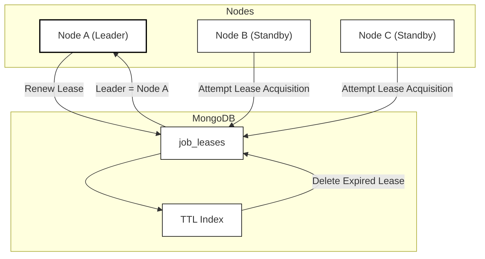

Modern distributed systems are typically deployed across multiple nodes for availability. Consider a nightly settlement job that processes millions of records. To avoid a single point of failure, we deploy three instances of the application across different availability zones.

While multiple instances improve availability, they introduce a new challenge:

> Only one instance should execute the batch at any given time.

If multiple instances process the same workload simultaneously, they may generate duplicate payments, duplicate reports, or inconsistent downstream data.

This article demonstrates how MongoDB's document expiration feature can be used to implement a lightweight leader-election mechanism for batch workloads. We will use a lease-based approach where only one node becomes the leader, while other nodes remain on standby. If the active leader crashes, another node automatically takes over.

If MongoDB is already part of your stack, this pattern avoids the operational cost of running a separate coordination service just to elect a leader for periodic batch work.

---

## The Problem

Three application instances run in parallel across availability zones. All are capable of running the batch job, but only one should actively execute it.

Requirements:

- High availability
- Automatic failover
- No manual intervention
- No additional infrastructure beyond MongoDB

---

## Traditional Solutions

Several technologies can solve leader election:

- Kubernetes Leader Election
- etcd
- Apache ZooKeeper
- Redis-based distributed locks
- Database advisory locks

These are excellent solutions, but introducing additional infrastructure may be unnecessary if MongoDB is already part of the application stack.

It helps to distinguish the primitives:

- A **lock** grants exclusive access until released.
- A **lease** grants exclusive access for a bounded time and expires automatically if not renewed.
- **Leader election** selects one active worker; leases are a common way to implement it.

MongoDB provides enough primitives to implement a lightweight lease-based leader election mechanism.

---

## The Core Idea

Instead of storing business data, we store ownership information.

Create a collection called `job_leases`.

Example document:

```json
{
  "_id": "daily-settlement-job",
  "owner": "node-a",
  "generation": 3,
  "expiresAt": "2026-05-29T18:00:00Z"
}
```

The rules are simple:

1. Whoever inserts the document first becomes the leader.
2. The leader periodically renews the lease.
3. MongoDB automatically deletes expired leases.
4. When the lease disappears, another node can acquire it.

This pattern is commonly known as a **lease**.

Unlike a traditional lock, a lease automatically expires if the owner stops renewing it.

---

## Creating the TTL Index

MongoDB supports automatic expiration of documents through TTL indexes.

Create the index:

```javascript
db.job_leases.createIndex(
  { expiresAt: 1 },
  { expireAfterSeconds: 0 }
)
```

With this configuration, MongoDB automatically removes documents whose `expiresAt` timestamp has passed.

A critical detail is that expiration is not instantaneous.

[MongoDB](https://www.mongodb.com/docs/manual/core/index-ttl/) runs a background TTL monitor that periodically scans for expired documents. So, deletion should be treated as **eventual**, not immediate.

That delay has a direct consequence: if `expiresAt` has passed but the document has not yet been deleted, standby nodes **cannot insert** a new lease because of the duplicate `_id`, and **no node is leader** until MongoDB removes the old document. Plan failover time as:

```text
lease duration + TTL deletion delay + standby retry interval
```

---

## Acquiring Leadership

Each node attempts to create the lease document.

For example:

```java
leaseRepository.insert(
    new Lease(
        "daily-settlement-job",
        nodeId,
        Instant.now().plusSeconds(30)
    )
);
```



There are two possible outcomes.

### Success

The insert succeeds.

```text
Node A inserted lease successfully.
```

Node A becomes the leader.

### Duplicate Key Exception

The insert fails because the document already exists.

```text
DuplicateKeyException
```

Another node currently owns the lease—or the previous lease document has not yet been removed by the TTL monitor.

Because MongoDB guarantees uniqueness of `_id`, only one node can successfully create the lease document at a time.

Standby nodes should treat acquisition as a **retry loop**: on duplicate key, wait briefly and try again. Do not assume leadership is available the moment `expiresAt` passes.

---

## Renewing the Lease

Once a node becomes leader, it must periodically renew its lease.

Example:

```javascript
db.job_leases.updateOne(
  {
    _id: "daily-settlement-job",
    owner: "node-a"
  },
  {
    $set: {
      expiresAt: futureTimestamp
    }
  }
)
```

A practical starting point:

```text
Lease Duration: 30 seconds
Renew Every: 10 seconds
```

The leader continuously extends the expiration time well before the lease expires, leaving buffer for transient network delays or brief MongoDB latency spikes.

---

## Failure Scenario

The real value of this approach becomes apparent during failures. With a 30-second lease and 10-second renewal interval, a typical sequence looks like this:

| Time | Event |
| ---- | ----- |
| T0 | Node A acquires the lease (`leader = Node A`) |
| T10 | Node A renews the lease |
| T20 | Node A crashes (`Node A unavailable`) |
| T30 | `expiresAt` passes; logical lease is expired |
| T31–T90 | TTL monitor has not yet deleted the document; standbys retry insert and receive duplicate key |
| T90+ | MongoDB deletes the expired document |
| T90+ | Node B insert succeeds; Node B becomes the new leader |

The system automatically recovers without human intervention, but failover is bounded by TTL deletion delay—not just lease duration.

---

## Preventing Split Brain

The most dangerous failure mode in distributed systems is split brain.

Split brain occurs when multiple nodes simultaneously believe they are the leader. A common trigger: the current leader pauses (long GC, network partition, thread stall), stops renewing, a new leader is elected, and the old leader resumes believing it still owns the job.

To reduce this risk:

### Use Short Lease Durations

Long leases slow failover unnecessarily. Prefer short leases with frequent renewal (for example, 30 seconds with renewal every 10 seconds) over multi-minute leases unless your batch runtime truly requires them.

### Continuously Verify Leadership

Never assume leadership is permanent. Re-check ownership immediately before performing side effects—not only at the start of the batch:

```java
if (stillLeader()) {
    executeBatch();
}
```

The node should confirm that it still owns the lease and that the lease `generation` (or equivalent fence token) matches what it expects.

### Use a Fence Token

Store a monotonically increasing `generation` field in the lease document. Increment it on each successful acquisition. Before writing side effects, verify the node holds the current generation. If an old leader wakes up after failover, its generation will be stale and work can be rejected safely.

### Renew Early

Avoid waiting until the last second to renew. Renewing at 10 seconds into a 30-second lease leaves enough buffer for transient network delays.

---

## Spring Boot Reference Implementation

The full source code is available on GitHub:
[github.com/sanjuthomas/leader-election-mongodb](https://github.com/sanjuthomas/leader-election-mongodb).

Clone the repository, point `MONGODB_URI` at your MongoDB instance, and run with Maven. To simulate multiple nodes on one machine, pass a distinct `-Dleader.node-id` and `--server.port` per instance (see the repository README).

The sample project uses the following structure:

```text
com.example.leader

├── LeaseDocument
├── LeaseRepository
├── LeaderElectionService
├── LeaseRenewalService
├── BatchScheduler
└── Application
```

Responsibilities:

| Component             | Responsibility                 |
| --------------------- | ------------------------------ |
| LeaseDocument         | MongoDB document definition    |
| LeaseRepository       | Data access                    |
| LeaderElectionService | Acquire leadership             |
| LeaseRenewalService   | Renew active lease             |
| BatchScheduler        | Execute batch only when leader |

The scheduler runs on every node, but only the current leader performs actual work.

---

## Observability

Leader election should be observable. Treat leadership state as a first class metric consistent with a [metrics-first observability](/posts/2026-01-01-metrics-first-observability/) approach.

Useful metrics include:

```text
leader_status              (gauge: 1 if this node is leader, else 0)
lease_acquisition_attempts
lease_acquisition_failures
lease_renewals
lease_renewal_failures
```

Useful log entries include:

```text
Leadership acquired
Leadership lost
Lease renewed
Lease expired
Failover detected
```

These metrics and logs significantly simplify troubleshooting.

---

## Production Considerations

### MongoDB Availability

This pattern assumes a **replica set** (or managed cluster such as Atlas) with a writable primary. During a MongoDB election or primary failover, lease renewals and acquisitions may fail temporarily. Size lease duration and renewal margin so brief MongoDB unavailability does not cause unnecessary leadership churn—or missed batch windows.

### Clock Synchronization

All nodes should use NTP.

Large clock drift between nodes can create lease inconsistencies.

### Renewal Margin

Always renew well before expiration.

This provides resilience against temporary network interruptions.

### Graceful Shutdown

When a node shuts down cleanly, delete the lease or allow it to expire without renewal so failover begins immediately instead of waiting for TTL deletion after `expiresAt`.

### Auditing

Consider storing additional metadata:

```json
{
  "_id": "daily-settlement-job",
  "owner": "node-a",
  "generation": 3,
  "expiresAt": "2026-05-29T18:00:00Z",
  "createdAt": "2026-05-29T17:00:00Z",
  "lastRenewedAt": "2026-05-29T17:59:50Z"
}
```

This information can be extremely useful during incident investigations.

---

## When Should You Use This Pattern?

This approach works well for:

- Scheduled batch jobs
- Settlement processing
- Report generation
- Data synchronization
- Cache refresh jobs
- Background maintenance tasks

This approach is generally not appropriate for:

- Distributed transactions
- Consensus systems
- Multi-leader architectures
- High-frequency trading systems
- Financial matching engines

For those scenarios, dedicated coordination systems such as etcd or Apache ZooKeeper are usually better choices.

---

## Conclusion

Leader election does not always require a dedicated coordination platform.

If your application already depends on MongoDB, TTL-backed leases provide a simple and reliable way to elect a leader while maintaining high availability.

By combining MongoDB's unique key guarantees with automatic document expiration, we can build a self-healing batch processing system where leadership automatically transfers when a node fails.

The result is a surprisingly powerful distributed systems primitive built from capabilities many teams already have in production.

**Reference implementation:** [github.com/sanjuthomas/leader-election-mongodb](https://github.com/sanjuthomas/leader-election-mongodb)
