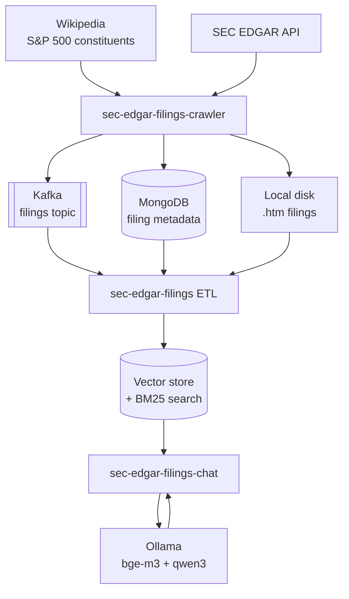
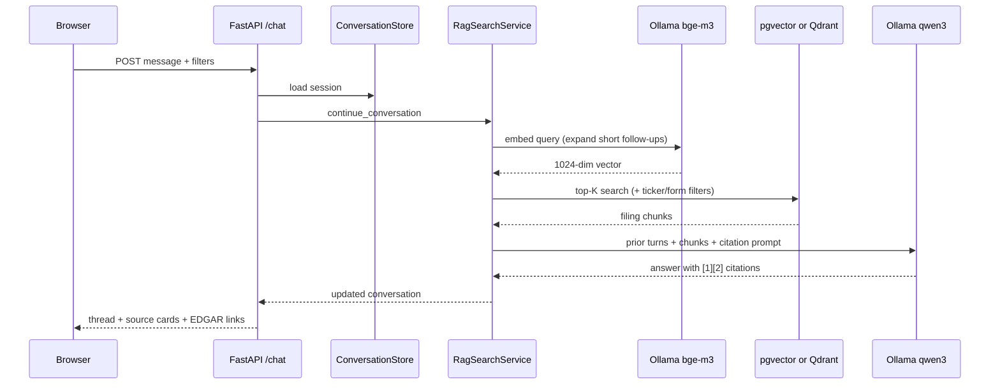

*Ask natural-language questions over real SEC filings — and get answers grounded in the source documents, with citations you can click through to EDGAR.*

SEC annual and quarterly reports are among the richest public sources of corporate information in the world. They are also long, repetitive, and poorly served by keyword search. A question like *"Did Goldman Sachs' board approve a buyback program?"* or *"Who are the elected directors?"* should not require reading hundreds of pages of inline XBRL HTML.

This post summarizes the architecture behind [**Chat with SEC Filings**](https://github.com/sanjuthomas/sec-edgar-filings-chat) — a multi-repo, event-driven RAG pipeline I built to make that kind of question answerable locally, with cited sources and no cloud LLM dependency.

---

## The Problem

Corporate filings on EDGAR are technically public, but practically opaque:

- **Volume** — the S&P 500 alone generates thousands of 10-K, 10-Q, and 8-K filings every year.
- **Format** — primary documents are inline XBRL HTML, not clean prose.
- **Search limits** — EDGAR's native search is accession- and keyword-oriented, not semantic.
- **Analyst workflow** — comparing language across quarters, tickers, or sections still means manual reading.

The goal was not a demo that calls an API once. It was a **repeatable pipeline**: ingest filings automatically, index them for semantic retrieval, and expose a chat interface that cites the passages it used.

---

## Design Principles

Several decisions shaped the architecture:

1. **Event-driven decoupling** — downloading, parsing, and embedding are separate services connected by Kafka. A new filing triggers downstream indexing without tight coupling.
2. **Local-first** — filings live on disk; embeddings and vectors stay on your machine. Ollama runs the LLM locally (`qwen3:30b` for generation, `bge-m3` for embeddings).
3. **Dual vector backends** — the same ETL pipeline feeds both **pgvector** (PostgreSQL + ParadeDB BM25 hybrid search) and **Qdrant**, so retrieval strategy can be compared without re-ingesting filings.
4. **Grounded answers only** — the LLM receives retrieved chunks and a system prompt requiring inline `[1]`, `[2]`, … citations with SEC EDGAR links. No retrieval, no answer.
5. **Composable repos** — each stage is its own GitHub repository with a published Docker image. A seventh repo wires them together with Compose.

---

## The Six Repositories

| Repository | Role | Stack |
|------------|------|-------|
| [sec-edgar-filings-crawler](https://github.com/sanjuthomas/sec-edgar-filings-crawler) | Download S&P 500 filings from EDGAR; store metadata in MongoDB; publish Kafka events | Python, FastAPI, MongoDB, Kafka |
| [sec-edgar-filings-to-pgvector](https://github.com/sanjuthomas/sec-edgar-filings-to-pgvector) | Kafka consumer: read `.htm` from disk, chunk, embed, load pgvector | Python, sentence-transformers, ParadeDB |
| [sec-edgar-filings-to-qdrant](https://github.com/sanjuthomas/sec-edgar-filings-to-qdrant) | Same pipeline into Qdrant | Python, sentence-transformers, Qdrant |
| [sec-edgar-filings-semantic-search-ui](https://github.com/sanjuthomas/sec-edgar-filings-semantic-search-ui) | Single-turn RAG search with cited answers | Spring Boot 3.4, Spring AI, Thymeleaf |
| [sec-edgar-filings-chat](https://github.com/sanjuthomas/sec-edgar-filings-chat) | **Multi-turn conversational RAG** with session history | FastAPI, Jinja2, psycopg / Qdrant REST |
| [sec-edgar-filings-rag-demo](https://github.com/sanjuthomas/sec-edgar-filings-rag-demo) | One-command Docker Compose for the full stack | Compose only — no application source |

The chat app is the capstone. The crawler and ETL repos are the foundation everything else depends on.

---

## End-to-End Architecture

> **Retrieval backends:** The diagram shows one indexing path, but the same Kafka events can feed either backend. **pgvector + pg_search** (ParadeDB) combines **dense** embedding similarity with **sparse** BM25 lexical search, fused via reciprocal rank fusion (RRF). **Qdrant** offers the same dense + sparse pattern with its own vector and full-text APIs. Pick one in the chat UI — no need to re-crawl filings.

### Stage 1 — Ingest (Crawler)

The crawler resolves S&P 500 tickers to SEC CIKs (cached in MongoDB), lists recent filings from EDGAR submissions, and downloads each filing's **primary document** if not already recorded.

For every newly registered filing it:

1. Writes the `.htm` file to local disk (bind-mounted external storage in Docker).
2. Upserts metadata into MongoDB (`filing_metadata`: ticker, form, accession number, `local_path`, dates).
3. Publishes a `filing.downloaded` event to Kafka when enabled.

Supported forms include `10-K`, `10-Q`, and amendments. Class-share tickers (`BRK.B` / `BRK-B`) normalize correctly. A FastAPI admin UI supports batch jobs (`refresh-sp500`, `download-sp500`) and a browse UI for inspecting stored data.

### Stage 2 — Transform & Index (ETL Consumers)

Both ETL services are Kafka consumers that **never call EDGAR directly**. They react to events, look up metadata in MongoDB, and read the file from disk:

1. **Parse** — extract readable text from inline XBRL HTML.
2. **Chunk** — split into passages sized for retrieval.
3. **Embed** — `BAAI/bge-m3` via sentence-transformers (1024 dimensions).
4. **Load** — upsert into pgvector (`filings` + `filing_chunks` with HNSW index) or Qdrant (`filing_chunks` collection).

Idempotency is built in: if an accession number already exists in the vector store, the consumer skips and commits the Kafka offset.

The pgvector path adds **hybrid retrieval** — vector similarity plus BM25 full-text search via ParadeDB's `pg_search`, fused with reciprocal rank fusion (RRF). That helps when a question uses exact financial terms ("EBITDA", "Section 16") that pure embedding search might miss.

### Stage 3 — Retrieve & Generate (Chat)

[`sec-edgar-filings-chat`](https://github.com/sanjuthomas/sec-edgar-filings-chat) orchestrates the RAG loop on each user message:

Key behaviors:

- **Multi-turn context** — prior user and assistant turns are sent to the LLM; short follow-ups ("What about Q2?") are expanded using the previous user message before embedding.
- **Configurable retrieval** — chunk count presets (10 / 25 / 50 / 100) or any value up to 500; optional ticker and form filters.
- **Dual vector store switch** — pgvector or Qdrant selectable in the UI without re-indexing.
- **Session management** — signed cookie stores up to 40 turns; "New conversation" clears context.
- **Transparency** — each turn shows retrieval time, generation time, model, vector store, and expandable source cards.

The earlier [semantic-search-ui](https://github.com/sanjuthomas/sec-edgar-filings-semantic-search-ui) repo implements the same RAG pattern as a **single-turn** Spring Boot + Spring AI app. The chat repo reimplements it in FastAPI with conversation state — same retrieval contracts, different UX.

---

## Running the Full Stack

[`sec-edgar-filings-rag-demo`](https://github.com/sanjuthomas/sec-edgar-filings-rag-demo) wires everything with Docker Compose. One `docker compose up` brings up:

| Service | Port | Purpose |
|---------|------|---------|
| Crawler (Admin + Browse) | 18080 | Download and inspect filings |
| pgvector Search UI | 18000 | Chunk retrieval only (no LLM) |
| Qdrant Search UI | 18002 | Chunk retrieval only |
| RAG Search Interface | 18095 | Single-turn cited answers |
| Kafka debug UI | 18081 | Optional message inspection |
| MongoDB | 10017 | Metadata |
| Kafka | 10092 | Event bus |
| pgvector DB | 10432 | PostgreSQL + vectors |
| Qdrant | 16333 | Vector collection + dashboard |

Ollama runs on the **host** (`localhost:11434`), not in a container — so GPU acceleration on a Mac or Linux box applies to both embedding and generation.

Typical bootstrap:

1. Refresh S&P 500 tickers from Wikipedia, then run a download job.
2. ETL consumers pick up Kafka events and populate both vector stores in parallel.
3. Open the chat UI, select pgvector or Qdrant, pull `bge-m3` and `qwen3:30b`, and ask a question.

---

## What We Achieved

Concrete outcomes from this work:

- **Automated S&P 500 coverage** — filings download, deduplicate, and index without manual file handling.
- **Production-shaped boundaries** — clear producer/consumer contracts (Kafka event schema, MongoDB metadata, shared disk paths) that allow each service to deploy and scale independently.
- **Comparable retrieval backends** — identical chunks in pgvector and Qdrant, with hybrid BM25+vector on the Postgres path.
- **Grounded, cited answers** — every response links back to the SEC EDGAR filing it came from.
- **Local privacy** — no filing content or questions leave your machine unless you choose to.
- **Published Docker images** — every application repo builds and publishes to Docker Hub; the demo repo is glue only.
- **Two chat implementations** — Spring AI (single-turn) and FastAPI (multi-turn), sharing the same vector schemas.

Example questions that work well today:

> Do you know if the Adobe board approved a buyback program?

> Who are the elected directors in Goldman Sachs?

Filter by ticker (`GS`) and form (`10-K`) to narrow retrieval when you know the target filing.

<video controls playsinline preload="metadata" width="100%">
  <source src="/videos/sec-filings-chat-demo.webm" type="video/webm">
  Your browser does not support the video tag.
</video>

*Screen recording of the chat UI answering a filing question with cited sources.*

---

## What Comes Next

The current pipeline answers *"what do the filings say?"* well. Several extensions would move it toward *"what do the filings mean together?"*

### Knowledge Graph

Vector search retrieves similar **passages**. A knowledge graph would capture **entities and relationships** across filings:

- Companies, officers, directors, subsidiaries, auditors
- Events: acquisitions, restatements, material weaknesses, buyback authorizations
- Temporal edges: "Director X joined in Q2 2024", "Segment Y was renamed in the 2023 10-K"

A practical path:

1. **Extract** structured entities from chunked text (NER + LLM-assisted relation extraction during ETL).
2. **Store** in Neo4j, Apache AGE (Postgres extension), or DuckDB with graph queries — co-located with existing Postgres infrastructure.
3. **Hybrid retrieval** — vector search for prose questions, graph traversal for relational questions ("Which S&P 500 companies changed auditors in the last two years?").
4. **Fusion at answer time** — pass both chunk context and subgraph summaries to the LLM.

The Kafka event bus already provides the hook: a third consumer could build the graph incrementally on each `filing.downloaded` event, the same way pgvector and Qdrant consumers do today.

### MCP Tools

[Model Context Protocol](https://modelcontextprotocol.io/) tools would expose the pipeline to Claude, Cursor, and other MCP clients without a custom web UI:

| Tool | Description |
|------|-------------|
| `search_filings` | Semantic search with ticker/form filters; returns ranked chunks |
| `ask_filing` | Full RAG answer with citations for a single question |
| `list_filings` | Query MongoDB metadata — recent 10-K/10-Q by ticker |
| `get_filing_section` | Fetch a specific accession or section from disk |
| `compare_filings` | Diff language across two accession numbers (e.g., risk factors YoY) |

An MCP server sitting in front of the existing FastAPI services would reuse `RagSearchService` and the chunk repositories — no re-architecture required. Agents could chain tools: list recent filings → search within one → ask a follow-up with graph context.

### Other Improvements

- **Broader universe** — extend beyond S&P 500 to Russell 2000, ETFs, or custom watchlists.
- **Section-aware chunking** — tag chunks with Item 1A (Risk Factors), Item 7 (MD&A), etc., for filtered retrieval.
- **Evaluation harness** — golden questions with expected citations to regression-test retrieval quality across embedding model or chunk-size changes.
- **Observability** — metrics on ingest lag (Kafka offset vs. EDGAR filing date), retrieval latency, and citation accuracy.

---

## Closing Thought

SEC filings are a stress test for information systems: messy HTML, legal language, high stakes, and readers who care about provenance. Building Chat with SEC Filings meant treating **ingest, index, retrieve, and cite** as separate engineering problems — connected by events, not monoliths.

The repos are open source and MIT-licensed. Start with the [RAG demo](https://github.com/sanjuthomas/sec-edgar-filings-rag-demo) for a one-command stack, or run [sec-edgar-filings-chat](https://github.com/sanjuthomas/sec-edgar-filings-chat) against an existing pgvector or Qdrant index.

If you are working on financial document AI — knowledge graphs, MCP tooling, or evaluation — I'd welcome collaboration on the next layer.

---

## Repository Index

- [sec-edgar-filings-crawler](https://github.com/sanjuthomas/sec-edgar-filings-crawler) — EDGAR downloader + Kafka producer
- [sec-edgar-filings-to-pgvector](https://github.com/sanjuthomas/sec-edgar-filings-to-pgvector) — Kafka → pgvector ETL + hybrid search
- [sec-edgar-filings-to-qdrant](https://github.com/sanjuthomas/sec-edgar-filings-to-qdrant) — Kafka → Qdrant ETL
- [sec-edgar-filings-semantic-search-ui](https://github.com/sanjuthomas/sec-edgar-filings-semantic-search-ui) — Single-turn RAG (Spring Boot)
- [sec-edgar-filings-chat](https://github.com/sanjuthomas/sec-edgar-filings-chat) — Multi-turn conversational RAG (FastAPI)
- [sec-edgar-filings-rag-demo](https://github.com/sanjuthomas/sec-edgar-filings-rag-demo) — Full-stack Docker Compose
